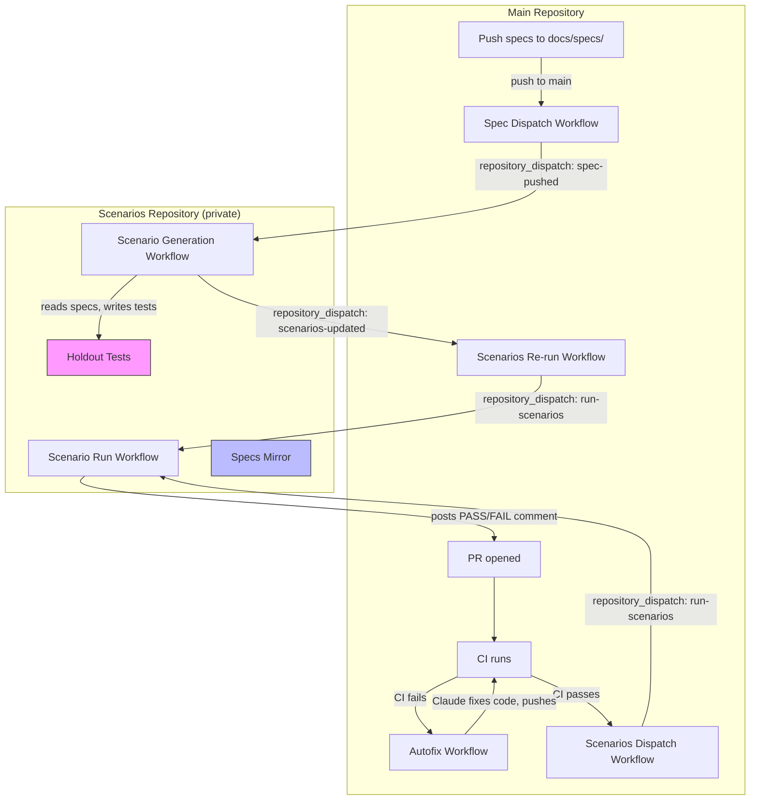
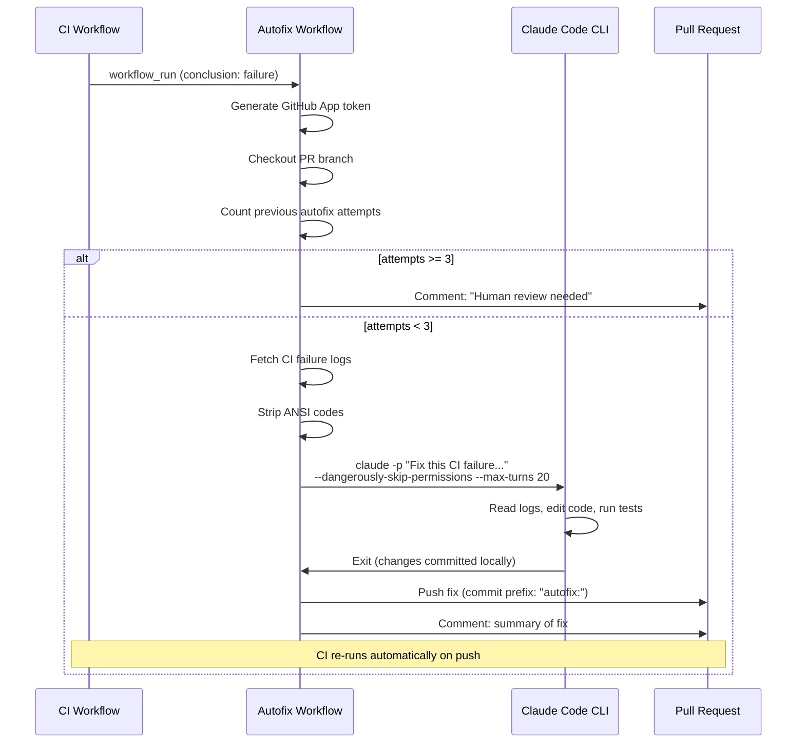
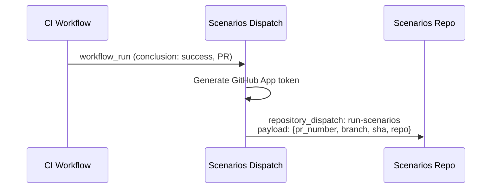
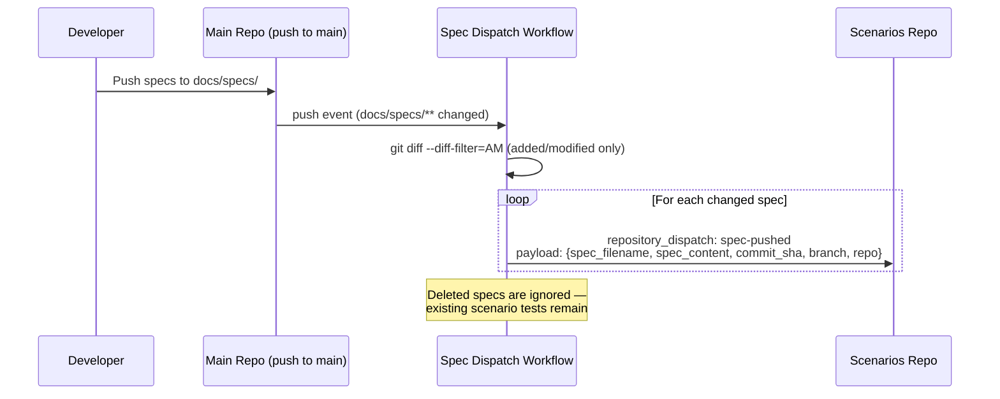
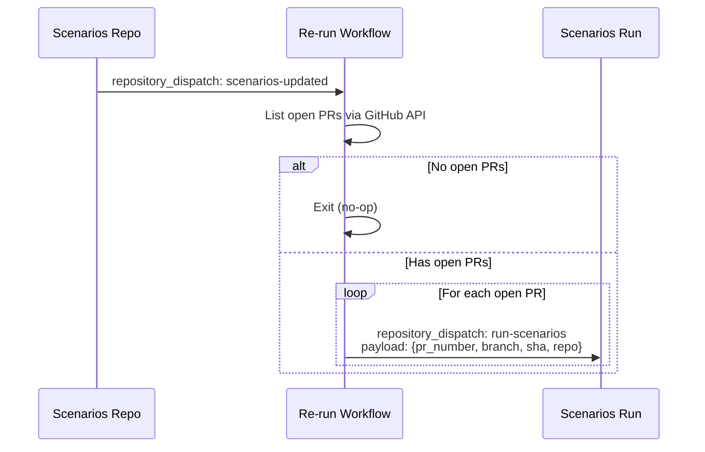
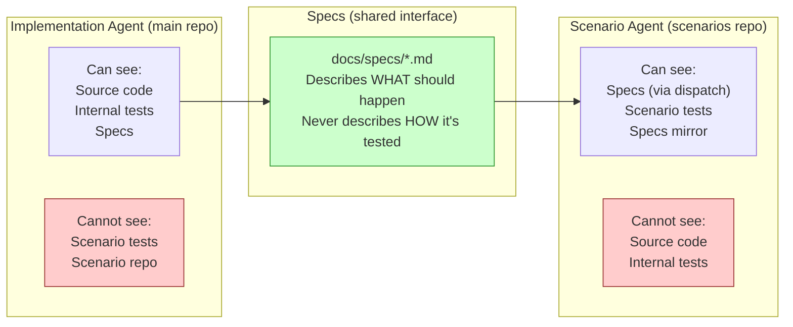
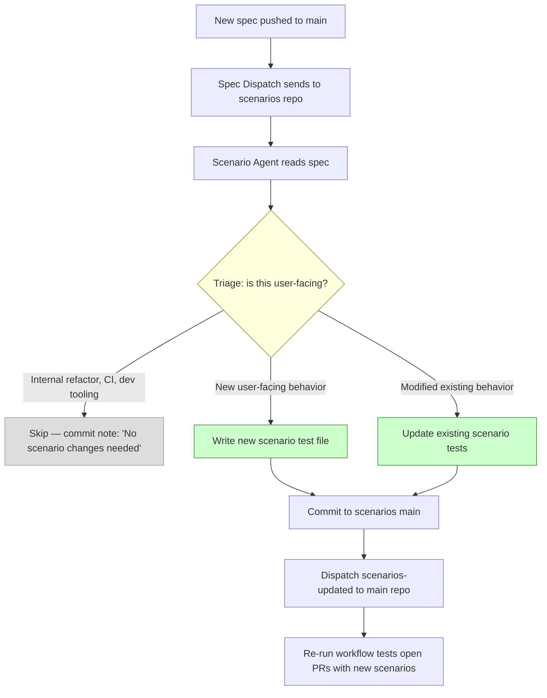
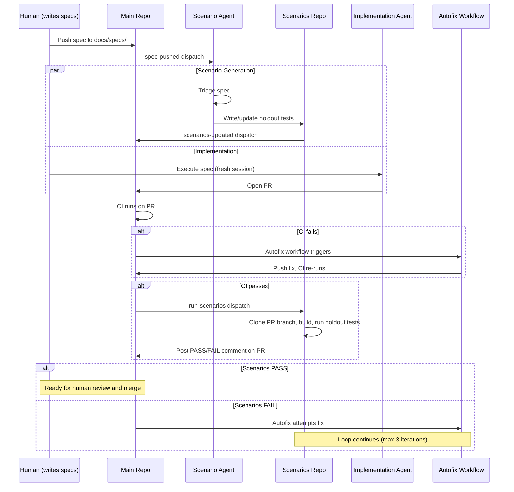

# Joycraft

> The craft of AI development — with joy, not darkness.

**Joycraft** is a CLI tool and Claude Code plugin that takes any project from Level 1 to Level 4 on [Dan Shapiro's 5 Levels of Vibe Coding](https://www.danshapiro.com/blog/2026/01/the-five-levels-from-spicy-autocomplete-to-the-software-factory/). One command gives you behavioral boundaries, atomic spec workflows, skill-driven development, and structured knowledge capture.

The name is a deliberate counter-narrative to "dark factory." Autonomous software development should bring craft and joy to engineering, not darkness.

## Quick Start

```bash
npx joycraft init
```

That's it. Joycraft auto-detects your tech stack and creates:

- **CLAUDE.md** with behavioral boundaries (Always / Ask First / Never) and correct build/test/lint commands
- **AGENTS.md** for Codex compatibility
- **Claude Code skills** installed to `.claude/skills/`:
  - `/joycraft-tune` — Assess your harness, apply upgrades, see your path to Level 5
  - `/joycraft-new-feature` — Interview → Feature Brief → Atomic Specs
  - `/joycraft-interview` — Lightweight brainstorm — yap about ideas, get a structured summary
  - `/joycraft-decompose` — Break a brief into small, testable specs
  - `/joycraft-session-end` — Capture discoveries, verify, commit
  - `/joycraft-implement-level5` — Set up Level 5: autofix loop, holdout scenarios, scenario evolution
- **docs/** structure — `briefs/`, `specs/`, `discoveries/`, `contracts/`, `decisions/`
- **Templates** — Atomic spec, feature brief, implementation plan, boundary framework, and workflow templates for scenario generation and autofix loops

Once you reach Level 4, you can set up the autonomous fix loop with `npx joycraft init-autofix`. See [Level 5: Autofix Loop](#level-5-autofix-loop) below.

### Supported Stacks

Node.js (npm/pnpm/yarn/bun), Python (poetry/pip/uv), Rust, Go, Swift, and generic (Makefile/Dockerfile).

Frameworks auto-detected: Next.js, FastAPI, Django, Flask, Actix, Axum, Express, Remix, and more.

## The Workflow

After init, open Claude Code and use the installed skills:

```
/joycraft-tune                  # Assess your harness, apply upgrades, see path to Level 5
/joycraft-interview             # Brainstorm freely — yap about ideas, get a structured summary
/joycraft-new-feature           # Interview → Feature Brief → Atomic Specs → ready to execute
/joycraft-decompose             # Break any feature into small, independent specs
/joycraft-session-end           # Wrap up — discoveries, verification, commit
/joycraft-implement-level5     # Set up Level 5 — autofix, holdout scenarios, evolution
```

The core loop:

```
Interview → Spec → Fresh Session → Execute → Discoveries → Ship
```

## Upgrade

When Joycraft templates and skills evolve, update without losing your customizations:

```bash
npx joycraft upgrade
```

Joycraft tracks what it installed vs. what you've customized. Unmodified files update automatically. Customized files show a diff and ask before overwriting. Use `--yes` for CI.

## Level 5: The Autonomous Loop

Level 5 is where specs go in and validated software comes out. Joycraft implements this as four interlocking GitHub Actions workflows, a separate scenarios repository, and two independent AI agents that can never see each other's work.

Run `/joycraft-implement-level5` in Claude Code for a guided setup, or use the CLI directly:

```bash
npx joycraft init-autofix --scenarios-repo my-project-scenarios --app-id 3180156
```

### Architecture Overview

Level 5 has four moving parts. Each is a GitHub Actions workflow that communicates via `repository_dispatch` events — no custom servers, no webhooks, no external services.



### The Four Workflows

#### 1. Autofix Workflow (`autofix.yml`)

Triggered when CI **fails** on a PR. Claude Code CLI reads the failure logs and attempts a fix.



**Key details:**
- Uses a GitHub App identity for pushes — avoids GitHub's anti-recursion protection
- Concurrency group per PR — only one autofix runs at a time per PR
- Max 3 iterations — posts "human review needed" if it can't fix it
- No `--model` flag — Claude CLI handles model selection
- Strips ANSI escape codes from logs so Claude gets clean text

#### 2. Scenarios Dispatch Workflow (`scenarios-dispatch.yml`)

Triggered when CI **passes** on a PR. Fires a `repository_dispatch` to the scenarios repo to run holdout tests against the PR branch.



#### 3. Spec Dispatch Workflow (`spec-dispatch.yml`)

Triggered when spec files are pushed to `main`. Sends the spec content to the scenarios repo so the scenario agent can write tests.



#### 4. Scenarios Re-run Workflow (`scenarios-rerun.yml`)

Triggered when the scenarios repo updates its tests. Re-dispatches all open PRs to the scenarios repo so they get tested with the latest holdout tests.



**Why this exists:** There's a race condition. The implementation agent might open a PR before the scenario agent finishes writing new tests. The re-run workflow handles this — when new tests land, all open PRs get re-tested. Worst case: a PR merges before the re-run, and the new tests protect the very next PR. You're never more than one cycle behind.

### The Holdout Wall

The core safety mechanism. Two agents, two repos, one shared interface (specs):



This is the same principle as a holdout set in machine learning. If the implementation agent could see the scenario tests, it would optimize to pass them specifically — not to build correct software. By keeping the wall intact, scenario tests catch real behavioral regressions, not test-gaming.

### Scenario Evolution

Scenarios aren't static. When you push new specs, the scenario agent automatically triages them and writes new holdout tests.



**The scenario agent's prompt instructs it to:**
- Act as a QA engineer, never a developer
- Write only behavioral tests (invoke the built artifact, assert on output)
- Never import source code or reference internal implementation
- Use a triage decision tree: SKIP / NEW / UPDATE
- Err on the side of writing a test if the spec is ambiguous

**The specs mirror:** The scenarios repo maintains a `specs/` folder that mirrors every spec it receives. This gives the scenario agent historical context ("what features already exist?") without access to the main repo's codebase.

### The Complete Loop

Here's the full lifecycle from spec to shipped, validated code:



### What Gets Installed

| Where | File | Purpose |
|-------|------|---------|
| Main repo | `.github/workflows/autofix.yml` | CI failure → Claude fix → push |
| Main repo | `.github/workflows/scenarios-dispatch.yml` | CI pass → trigger holdout tests |
| Main repo | `.github/workflows/spec-dispatch.yml` | Spec push → trigger scenario generation |
| Main repo | `.github/workflows/scenarios-rerun.yml` | New tests → re-test open PRs |
| Scenarios repo | `workflows/run.yml` | Clone PR, build, run tests, post results |
| Scenarios repo | `workflows/generate.yml` | Receive spec, run scenario agent |
| Scenarios repo | `prompts/scenario-agent.md` | Scenario agent prompt template |
| Scenarios repo | `example-scenario.test.ts` | Example holdout test |
| Scenarios repo | `package.json` | Minimal vitest setup |
| Scenarios repo | `README.md` | Explains holdout pattern to contributors |

### Prerequisites

- **GitHub App** — Provides a separate identity for autofix pushes (avoids GitHub's anti-recursion protection). You can install the shared [Joycraft Autofix](https://github.com/apps/joycraft-autofix) app (App ID: `3180156`) or create your own.
- **Secrets** — `JOYCRAFT_APP_PRIVATE_KEY` and `ANTHROPIC_API_KEY` on both the main and scenarios repos.
- **Scenarios repo** — A private repository where holdout tests live. Created during setup.

### Cost

Validated in the Pipit trial (~3 minutes, one iteration, zero human intervention). With Claude Sonnet + `--max-turns 20` + max 3 iterations per PR:
- **Autofix:** ~$0.50 per attempt, worst case ~$1.50 per PR (3 iterations)
- **Scenario generation:** ~$0.20 per spec dispatch
- **Solo dev with ~10 PRs/month:** ~$5-10/month for the full loop

The iteration guard and max-turns cap prevent runaway costs.

## Git Autonomy

When `/joycraft-tune` runs for the first time, it asks one question: **how autonomous should git be?**

- **Cautious** (default) — commits freely, asks before pushing or opening PRs. Good for learning the workflow.
- **Autonomous** — commits, pushes to feature branches, and opens PRs without asking. Good for spec-driven development where you want full send.

Either way, Joycraft generates explicit git boundaries in your CLAUDE.md: commit message format (`verb: message`), specific file staging (no `git add -A`), no secrets in commits, no force-pushing.

## How It Works with AI Agents

**Claude Code** reads `CLAUDE.md` automatically and discovers skills in `.claude/skills/`. The behavioral boundaries guide every action. The skills provide structured workflows accessible via `/slash-commands`.

**Codex** reads `AGENTS.md` — same boundaries and commands in a concise format optimized for smaller context windows.

Both agents get the same guardrails and the same development workflow. Joycraft doesn't write your project code — it builds the *system* that makes AI-assisted development reliable.

### Team Sharing

Skills live in `.claude/skills/` which is **not** gitignored by default. Commit it so your whole team gets the workflow:

```bash
git add .claude/skills/ docs/
git commit -m "add: Joycraft harness"
```

Joycraft also installs a session-start hook that checks for updates — if your templates are outdated, you'll see a one-line nudge when Claude Code starts.

## Why This Exists

Most developers using AI tools are at Level 2 — they prompt, they iterate, they feel productive. But [METR's randomized control trial](https://metr.org/) found experienced developers using AI tools actually completed tasks **19% slower**, while *believing* they were 24% faster. The problem isn't the tools. It's the absence of structure around them.

The teams seeing transformative results — [StrongDM](https://factory.strongdm.ai/) shipping an entire product with 3 engineers, [Spotify Honk](https://www.danshapiro.com/blog/2026/01/the-five-levels-from-spicy-autocomplete-to-the-software-factory/) merging 1,000 PRs every 10 days, Anthropic generating effectively 100% of their code with AI — all share the same pattern: **they don't prompt AI to write code. They write specs and let AI execute them.**

Joycraft packages that pattern into something anyone can install.

### The methodology

Joycraft's approach is synthesized from several sources:

**Spec-driven development.** Instead of prompting AI in conversation, you write structured specifications — Feature Briefs that capture the *what* and *why*, then Atomic Specs that break work into small, testable, independently executable units. Each spec is self-contained: an agent can pick it up without reading anything else. This follows [Addy Osmani's](https://addyosmani.com/blog/good-spec/) principles for AI-consumable specs and [GitHub's Spec Kit](https://github.blog/ai-and-ml/generative-ai/spec-driven-development-with-ai-get-started-with-a-new-open-source-toolkit/) 4-phase process (Specify → Plan → Tasks → Implement).

**Context isolation.** [Boris Cherny](https://www.lennysnewsletter.com/p/head-of-claude-code-what-happens) (Head of Claude Code at Anthropic) recommends: interview in one session, write the spec, then execute in a *fresh session* with clean context. Joycraft's `/joycraft-new-feature` → `/joycraft-decompose` → execute workflow enforces this naturally. The interview session captures intent; the execution session has only the spec.

**Behavioral boundaries.** CLAUDE.md isn't a suggestion box — it's a contract. Joycraft installs a three-tier boundary framework (Always / Ask First / Never) that prevents the most common AI development failures: overwriting user files, skipping tests, pushing without approval, hardcoding secrets. This is [Addy Osmani's](https://addyosmani.com/blog/good-spec/) "boundaries" principle made concrete.

**Knowledge capture over session notes.** Most session notes are never re-read. Joycraft's `/joycraft-session-end` skill captures only *discoveries* — assumptions that were wrong, APIs that behaved unexpectedly, decisions made during implementation that aren't in the spec. If nothing surprising happened, you capture nothing. This keeps the signal-to-noise ratio high.

**External holdout scenarios.** [StrongDM's Software Factory](https://factory.strongdm.ai/) proved that AI agents will [actively game visible test suites](https://palisaderesearch.org/blog/specification-gaming). Their solution: scenarios that live *outside* the codebase, invisible to the agent during development. Like a holdout set in ML, this prevents overfitting. Joycraft now implements this directly — `init-autofix` sets up the holdout wall, the scenario agent, and the GitHub App integration, not just provides templates for it.

**The 5-level framework.** [Dan Shapiro's levels](https://www.danshapiro.com/blog/2026/01/the-five-levels-from-spicy-autocomplete-to-the-software-factory/) give you a map. Level 2 (Junior Developer) is where most teams plateau. Level 3 (Developer as Manager) means your life is diffs. Level 4 (Developer as PM) means you write specs, not code. Level 5 (Dark Factory) means specs in, software out. Joycraft's `/joycraft-tune` assessment tells you where you are and what to do next.

## Standing on the Shoulders of Giants

Joycraft synthesizes ideas and patterns from people doing extraordinary work in AI-assisted software development:

- **[Dan Shapiro](https://www.danshapiro.com/)** ([@danshapiro](https://github.com/danshapiro)) — The [5 Levels of Vibe Coding](https://www.danshapiro.com/blog/2026/01/the-five-levels-from-spicy-autocomplete-to-the-software-factory/) framework that Joycraft's assessment and level system is built on
- **[StrongDM](https://www.strongdm.com/)** / **Justin McCarthy** ([@justinmccarthy](https://github.com/justinmccarthy)) — The [Software Factory](https://factory.strongdm.ai/): spec-driven autonomous development, NLSpec, external holdout scenarios, and the proof that 3 engineers can outproduce 30
- **[Boris Cherny](https://performancejs.com/)** ([@bcherny](https://github.com/bcherny)) — Head of Claude Code at Anthropic. The interview → spec → fresh session → execute pattern, and the insight that [context isolation produces better results](https://www.lennysnewsletter.com/p/head-of-claude-code-what-happens)
- **[Addy Osmani](https://addyosmani.com/)** ([@addyosmani](https://github.com/addyosmani)) — [What makes a good spec for AI](https://addyosmani.com/blog/good-spec/): commands, testing, project structure, code style, git workflow, and boundaries
- **[METR](https://metr.org/)** — The [randomized control trial](https://metr.org/) that proved unstructured AI use makes experienced developers slower, validating the need for harnesses
- **[Nate B Jones](https://www.youtube.com/@natebj)** ([@nateBJ](https://github.com/nateBJ)) — His [video on the 5 Levels of Vibe Coding](https://www.youtube.com/watch?v=bDcgHzCBgmQ) made this research accessible and inspired turning Joycraft into a tool anyone can use
- **[Simon Willison](https://simonwillison.net/)** ([@simonw](https://github.com/simonw)) — [Analysis of the Software Factory](https://simonwillison.net/2026/Feb/7/software-factory/) that helped contextualize StrongDM's approach for the broader community
- **[Anthropic](https://www.anthropic.com/)** — Claude Code's skills, hooks, and CLAUDE.md system that makes tool-native AI development possible, and the [harness patterns for long-running agents](https://www.anthropic.com/engineering/effective-harnesses-for-long-running-agents)

## License

MIT
