# Joycraft

<p align="center">
  
</p>

> The craft of AI development. With joy, not darkness.

## What is Joycraft?

Joycraft is a CLI tool and [Claude Code](https://docs.anthropic.com/en/docs/claude-code) plugin that upgrades your AI development workflow. It installs skills, behavioral boundaries, templates, and documentation structure into any project, taking you from unstructured prompting to autonomous spec-driven development.

If you've been using Claude Code (or any AI coding tool) and your workflow looks like this:

> Prompt → wait → read output → "no, not that" → re-prompt → fix hallucination → re-prompt → manually fix → "ok close enough" → commit

...then Joycraft is for you.

This project started as a personal exploration by [@maksutovic](https://github.com/maksutovic). I was working across multiple client projects, spending more time wrestling with prompts than building software. I knew Claude Code was capable of extraordinary work, but my *process* was holding it back. I was vibe coding - and vibe coding doesn't scale.

The spark was [Nate B Jones' video on the 5 Levels of Vibe Coding](https://www.youtube.com/watch?v=bDcgHzCBgmQ). It mapped out a progression I hadn't seen articulated before - from "spicy autocomplete" to fully autonomous development - and lit my brain up to the potential of what Claude Code could do with the right harness around it. Joycraft is the result of that exploration: a tool that encodes the patterns, boundaries, and workflows that make AI-assisted development actually deterministic.

### The core idea

Joycraft is simple. It's a set of **skills** (slash commands for Claude Code) and **instructions** (CLAUDE.md boundaries) that guide you and your agent through a structured development process:

- **Levels 1-4:** Skills like `/joycraft-tune`, `/joycraft-new-feature`, and `/joycraft-interview` replace unstructured prompting with spec-driven development. You interview, you write specs, the agent executes. No back-and-forth.
- **Level 5:** The `/joycraft-implement-level5` skill sets up the autonomous loop where specs go in and validated software comes out, with holdout scenario testing that prevents the agent from gaming its own tests.

StrongDM calls their Level 5 fully autonomous loop a "Dark Factory" - which, albeit a cool name, the world has so much darkness in it right now. I wanted a name that extolled more of what I believe tools like this can provide: joy and craftsmanship. Hence "Joycraft."

### What are the levels?

[Dan Shapiro's 5 Levels of Vibe Coding](https://www.danshapiro.com/blog/2026/01/the-five-levels-from-spicy-autocomplete-to-the-software-factory/) provides the framework:

| Level | Name | What it looks like | Joycraft's role |
|-------|------|--------------------|-----------------|
| 1 | Autocomplete | Tab-complete suggestions | - |
| 2 | Junior Developer | Prompt → iterate → fix → repeat | `/joycraft-tune` assesses where you are |
| 3 | Developer as Manager | Your life is reviewing diffs | Behavioral boundaries in CLAUDE.md |
| 4 | Developer as PM | You write specs, agent writes code | `/joycraft-new-feature` + `/joycraft-decompose` |
| 5 | Software Factory | Specs in, validated software out | `/joycraft-implement-level5` sets up the autonomous loop |

Most developers plateau at Level 2. Joycraft's job is to move you up.

### Platform support

Joycraft is currently focused on making the Claude Code experience state-of-the-art. Better [Codex](https://openai.com/codex) support is coming. `AGENTS.md` generation is already included, and deeper integration is on the roadmap.

## Quick Start

First, install the CLI:

```bash
npm install -g joycraft
```

Then navigate to your project's root directory and initialize:

```bash
cd /path/to/your/project
npx joycraft init
```

Joycraft auto-detects your tech stack and creates:

- **CLAUDE.md** with behavioral boundaries (Always / Ask First / Never) and correct build/test/lint commands
- **AGENTS.md** for Codex compatibility
- **Claude Code skills** installed to `.claude/skills/`:
  - `/joycraft-tune` Assess your harness, apply upgrades, see your path to Level 5
  - `/joycraft-new-feature` Interview → Feature Brief → Atomic Specs
  - `/joycraft-interview` Lightweight brainstorm. Yap about ideas, get a structured summary
  - `/joycraft-decompose` Break a brief into small, testable specs
  - `/joycraft-add-fact` Capture project knowledge on the fly -- routes to the right context doc
  - `/joycraft-lockdown` Generate constrained execution boundaries (read-only tests, deny patterns)
  - `/joycraft-verify` Spawn a separate subagent to independently verify implementation against spec
  - `/joycraft-session-end` Capture discoveries, verify, commit, push
  - `/joycraft-implement-level5` Set up Level 5 (autofix loop, holdout scenarios, scenario evolution)
- **docs/** structure: `briefs/`, `specs/`, `discoveries/`, `contracts/`, `decisions/`, `context/`
- **Context documents** in `docs/context/`: production map, dangerous assumptions, decision log, institutional knowledge, and troubleshooting guide
- **Templates** including atomic spec, feature brief, implementation plan, boundary framework, and workflow templates for scenario generation and autofix loops

Once you reach Level 4, you can set up the autonomous loop with `/joycraft-implement-level5`. See [Level 5: The Autonomous Loop](#level-5-the-autonomous-loop) below.

### Supported Stacks

Node.js (npm/pnpm/yarn/bun), Python (poetry/pip/uv), Rust, Go, Swift, and generic (Makefile/Dockerfile).

Frameworks auto-detected: Next.js, FastAPI, Django, Flask, Actix, Axum, Express, Remix, and more.

## The Workflow

After init, open Claude Code and use the installed skills:

```
/joycraft-tune                  # Assess your harness, apply upgrades, see path to Level 5
/joycraft-interview             # Brainstorm freely, yap about ideas, get a structured summary
/joycraft-new-feature           # Interview → Feature Brief → Atomic Specs → ready to execute
/joycraft-decompose             # Break any feature into small, independent specs
/joycraft-add-fact              # Capture a fact mid-session -- auto-routes to the right context doc
/joycraft-lockdown              # Generate constrained execution boundaries for autonomous sessions
/joycraft-verify                # Independent verification -- spawns a subagent to check your work
/joycraft-session-end           # Wrap up: discoveries, verification, commit, push
/joycraft-implement-level5     # Set up Level 5 (autofix, holdout scenarios, evolution)
```

The core loop:

```
Interview → Spec → Fresh Session → Execute → Discoveries → Ship
```

## The Interview: Why It Matters

The single biggest upgrade Joycraft makes to your workflow is replacing the prompt-iterate-fix cycle with a **structured interview**.

Here's the problem with how most of us use AI coding tools: we open a session and start typing. "Build me a notification system." The agent starts writing code immediately. It makes assumptions about your data model, your UI framework, your error handling strategy, your deployment target. You catch some of these mid-flight, correct them, the agent adjusts, introduces new assumptions. Three hours later you have something that *kind of* works but is built on a foundation of guesses.

Joycraft flips this. Before the agent writes a single line of code, you have a conversation about *what you're building and why*.

### Two interview modes

**`/joycraft-interview`** is the lightweight brainstorm. You yap about an idea, the agent asks clarifying questions, and you get a structured summary saved to `docs/briefs/`. Good for early-stage thinking when you're not ready to commit to building anything yet. No pressure, no specs, just organized thought.

**`/joycraft-new-feature`** is the full workflow. This is the structured interview that produces a **Feature Brief** (the what and why) and then decomposes it into **Atomic Specs** (small, testable, independently executable units of work). Each spec is self-contained. An agent in a fresh session can pick it up and execute without reading anything else.

### Why this works

The insight comes from [Boris Cherny](https://www.lennysnewsletter.com/p/head-of-claude-code-what-happens) (Head of Claude Code at Anthropic): interview in one session, write the spec, then execute in a *fresh session* with clean context. The interview captures your intent. The spec is the contract. The execution session has only the spec. No baggage from the conversation, no accumulated misunderstandings, no context window full of abandoned approaches.

This is what separates Level 2 (back-and-forth prompting) from Level 4 (spec-driven development). You stop being a typist correcting an agent's guesses and start being a PM defining what needs to be built.

```mermaid
flowchart LR
    A["/joycraft-interview<br/>(brainstorm)"] --> B["Draft Brief<br/>docs/briefs/"]
    B --> C["/joycraft-new-feature<br/>(structured interview)"]
    C --> D["Feature Brief<br/>(what & why)"]
    D --> E["/joycraft-decompose"]
    E --> F["Atomic Specs<br/>docs/specs/"]
    F --> G["Fresh Session<br/>Execute each spec"]
    G --> H["/joycraft-session-end<br/>(discoveries + commit)"]

    style A fill:#e8f4fd,stroke:#369
    style C fill:#e8f4fd,stroke:#369
    style F fill:#cfc,stroke:#393
    style G fill:#ffd,stroke:#993
```



### What a good spec looks like

An atomic spec produced by `/joycraft-decompose` has:

- **What:** One paragraph. A developer with zero context understands the change in 15 seconds.
- **Why:** One sentence. What breaks or is missing without this?
- **Acceptance criteria:** Checkboxes. Testable. No ambiguity.
- **Affected files:** Exact paths, what changes in each.
- **Edge cases:** Table of scenarios and expected behavior.

The agent doesn't guess. It reads the spec and executes. If something's unclear, the spec is wrong. Fix the spec, not the conversation.

## Upgrade

When Joycraft templates and skills evolve, update without losing your customizations:

```bash
npx joycraft upgrade
```

Joycraft tracks what it installed vs. what you've customized. Unmodified files update automatically. Customized files show a diff and ask before overwriting. Use `--yes` for CI.

> **Note:** If you're upgrading from an early version, deprecated skill directories (e.g., `/joy`, `/joysmith`, `/tune`) are automatically removed during upgrade.

## Level 5: The Autonomous Loop

> **A note on complexity:** Setting up Level 5 does have some moving parts and, depending on the complexity of your stack (software vs. hardware, monorepo vs. single app, etc.), this will require a good amount of prompting and trial-and-error to get right. I've done my best to make this as painless as possible, but just note - this is not a one-shot-prompt-done-in-5-minutes kind of thing. For small projects and simple stacks it will be easy, but any level of complexity is going to take some iteration, so plan ahead. Full step-by-step guides along with a video coming soon.

Level 5 is where specs go in and validated software comes out — four GitHub Actions workflows, a separate scenarios repo, and two AI agents that can never see each other's work. Run `/joycraft-implement-level5` for guided setup, or `npx joycraft init-autofix` via CLI.

See the full **[Level 5 Autonomy Guide](docs/guides/level-5-autonomy.md)** for architecture diagrams, setup steps, workflow details, and cost estimates.

## Tuning: Risk Interview & Git Autonomy

When `/joycraft-tune` runs for the first time, it does two things:

### Risk interview

3-5 targeted questions about what's dangerous in your project (production databases, live APIs, secrets, files that should be off-limits). From your answers, Joycraft generates:

- **NEVER rules** for CLAUDE.md (e.g., "NEVER connect to production DB")
- **Deny patterns** for `.claude/settings.json` (blocks dangerous bash commands)
- **`docs/context/production-map.md`** documenting what's real vs. safe to touch
- **`docs/context/dangerous-assumptions.md`** documenting "Agent might assume X, but actually Y"

This takes 2-3 minutes and dramatically reduces the chance of your agent doing something catastrophic.

### Git autonomy

One question: **how autonomous should git be?**

- **Cautious** (default) commits freely but asks before pushing or opening PRs. Good for learning the workflow.
- **Autonomous** commits, pushes to feature branches, and opens PRs without asking. Good for spec-driven development where you want full send.

Either way, Joycraft generates explicit git boundaries in your CLAUDE.md: commit message format (`verb: message`), specific file staging (no `git add -A`), no secrets in commits, no force-pushing.

## Test-First Development

Joycraft enforces a test-first workflow because tests are the mechanism to autonomy. Without tests, your agent implements 9 specs and you have to manually verify each one. With tests, the agent knows when it's done and you can trust the output.

### How it works

When you run `/joycraft-new-feature`, the interview now includes test-focused questions: what test types your project uses, how fast your tests need to run for iteration, and whether you want lockdown mode. Every atomic spec generated by `/joycraft-decompose` includes a **Test Plan** that maps each acceptance criterion to at least one test.

The execution order is enforced:

1. **Write failing tests first** -- the agent writes tests from the spec's Test Plan
2. **Run them and confirm they fail** -- if they pass immediately, something is wrong (you're testing the wrong thing)
3. **Implement until tests pass** -- the tests are the contract

### The three laws of test harnesses

These are baked into every spec template, discovered through real autonomous development:

1. **Tests must fail first.** If your test harness doesn't have failing tests, the agent will write tests that pass trivially -- testing the library instead of your function.
2. **Tests must run against your actual function.** Not a reimplementation, not a mock, not the wrapped library. The test calls your code.
3. **Tests must detect individual changes.** You need fast smoke tests (seconds, not minutes) so you know if a single change helped or hurt.

### Lockdown mode

For complex stacks or long autonomous sessions, `/joycraft-lockdown` generates constrained execution boundaries:

- **NEVER rules** for editing test files (read-only)
- **Deny patterns** for package installs, network access, log reading
- **Permission mode recommendations** (see below)

This prevents the agent from going rogue -- downloading SDKs, pinging random IPs, clearing test files, or filling context with log output. Lockdown is optional and most useful for complex tech stacks (hardware, firmware, multi-device workflows).

### Independent verification

`/joycraft-verify` spawns a separate subagent with a clean context window to independently check your implementation against the spec. The verifier reads the acceptance criteria, runs the tests, and produces a structured pass/fail verdict. It cannot edit any code -- read-only plus test execution only.

This follows [Anthropic's finding](https://www.anthropic.com/engineering/harness-design-long-running-apps) that "agents reliably skew positive when grading their own work" and that separating the worker from the evaluator consistently outperforms self-evaluation.

## Claude Code Permission Modes

You do **not** need `--dangerously-skip-permissions` for autonomous development. Claude Code offers safer alternatives that Joycraft recommends based on your use case:

| Your situation | Permission mode | What it does |
|---|---|---|
| Interactive development | `acceptEdits` | Auto-approves file edits, prompts for shell commands |
| Long autonomous session | `auto` | Safety classifier reviews each action, blocks scope escalation |
| Autonomous spec execution | `dontAsk` + allowlist | Only pre-approved commands run, everything else denied |
| Planning and exploration | `plan` | Claude can only read and propose, no edits allowed |

### When to use what

**`--permission-mode auto`** is the best default for most developers. A background classifier (Sonnet) reviews each action before execution, blocking things like: downloading unexpected packages, accessing unfamiliar infrastructure, or escalating beyond the task scope. It adds minimal latency and catches the exact problems that make autonomous development scary.

**`--permission-mode dontAsk`** is for maximum control. You define an explicit allowlist of what the agent can do (write code, run specific test commands) and everything else is silently denied. No prompts, no surprises. This is what Joycraft's `/joycraft-lockdown` skill helps you configure.

**`--dangerously-skip-permissions`** should only be used in isolated containers or VMs with no internet access. It bypasses all safety checks and cannot be overridden by subagents.

Both `/joycraft-lockdown` and `/joycraft-tune` now recommend the appropriate permission mode based on your project's risk profile.

## How It Works with AI Agents

**Claude Code** reads `CLAUDE.md` automatically and discovers skills in `.claude/skills/`. The behavioral boundaries guide every action. The skills provide structured workflows accessible via `/slash-commands`.

**Codex** reads `AGENTS.md`, which provides the same boundaries and commands in a concise format optimized for smaller context windows.

Both agents get the same guardrails and the same development workflow. Joycraft doesn't write your project code. It builds the *system* that makes AI-assisted development reliable.

### Team Sharing

Skills live in `.claude/skills/` which is **not** gitignored by default. Commit it so your whole team gets the workflow:

```bash
git add .claude/skills/ docs/
git commit -m "add: Joycraft harness"
```

Joycraft also installs a session-start hook that checks for updates. If your templates are outdated, you'll see a one-line nudge when Claude Code starts.

## Why This Exists

Most developers using AI tools are at Level 2. They prompt, they iterate, they feel productive. But [METR's randomized control trial](https://metr.org/) found experienced developers using AI tools actually completed tasks **19% slower**, while *believing* they were 24% faster. The problem isn't the tools. It's the absence of structure around them.

The teams seeing transformative results ([StrongDM](https://factory.strongdm.ai/) shipping an entire product with 3 engineers, [Spotify Honk](https://www.danshapiro.com/blog/2026/01/the-five-levels-from-spicy-autocomplete-to-the-software-factory/) merging 1,000 PRs every 10 days, Anthropic generating effectively 100% of their code with AI) all share the same pattern: **they don't prompt AI to write code. They write specs and let AI execute them.**

Joycraft packages that pattern into something anyone can install.

### The methodology

Joycraft's approach is synthesized from several sources:

**Spec-driven development.** Instead of prompting AI in conversation, you write structured specifications. Feature Briefs capture the *what* and *why*, then Atomic Specs break work into small, testable, independently executable units. Each spec is self-contained: an agent can pick it up without reading anything else. This follows [Addy Osmani's](https://addyosmani.com/blog/good-spec/) principles for AI-consumable specs and [GitHub's Spec Kit](https://github.blog/ai-and-ml/generative-ai/spec-driven-development-with-ai-get-started-with-a-new-open-source-toolkit/) 4-phase process (Specify → Plan → Tasks → Implement).

**Context isolation.** [Boris Cherny](https://www.lennysnewsletter.com/p/head-of-claude-code-what-happens) (Head of Claude Code at Anthropic) recommends: interview in one session, write the spec, then execute in a *fresh session* with clean context. Joycraft's `/joycraft-new-feature` → `/joycraft-decompose` → execute workflow enforces this naturally. The interview session captures intent; the execution session has only the spec.

**Behavioral boundaries.** CLAUDE.md isn't a suggestion box, it's a contract. Joycraft installs a three-tier boundary framework (Always / Ask First / Never) that prevents the most common AI development failures: overwriting user files, skipping tests, pushing without approval, hardcoding secrets. This is [Addy Osmani's](https://addyosmani.com/blog/good-spec/) "boundaries" principle made concrete.

**Test-first as the mechanism to autonomy.** Tests aren't a nice-to-have, they're the bridge between "agent writes code" and "agent writes *correct* code." Every spec includes a Test Plan mapping acceptance criteria to tests, and the agent must write failing tests before implementing. This follows the three laws of test harnesses discovered through real autonomous development, and aligns with [Anthropic's harness design research](https://www.anthropic.com/engineering/harness-design-long-running-apps) which found that agents reliably skip verification unless explicitly constrained.

**Separation of evaluation from implementation.** [Anthropic's research](https://www.anthropic.com/engineering/harness-design-long-running-apps) found that "agents reliably skew positive when grading their own work." Joycraft addresses this at two levels: `/joycraft-verify` spawns a separate subagent with clean context to independently verify against the spec, and Level 5's holdout scenarios provide external evaluation the implementation agent can never see.

**Knowledge capture over session notes.** Most session notes are never re-read. Joycraft's `/joycraft-session-end` skill captures only *discoveries*: assumptions that were wrong, APIs that behaved unexpectedly, decisions made during implementation that aren't in the spec. If nothing surprising happened, you capture nothing. This keeps the signal-to-noise ratio high.

**External holdout scenarios.** [StrongDM's Software Factory](https://factory.strongdm.ai/) proved that AI agents will [actively game visible test suites](https://palisaderesearch.org/blog/specification-gaming). Their solution: scenarios that live *outside* the codebase, invisible to the agent during development. Like a holdout set in ML, this prevents overfitting. Joycraft now implements this directly. `init-autofix` sets up the holdout wall, the scenario agent, and the GitHub App integration.

**The 5-level framework.** [Dan Shapiro's levels](https://www.danshapiro.com/blog/2026/01/the-five-levels-from-spicy-autocomplete-to-the-software-factory/) give you a map. Level 2 (Junior Developer) is where most teams plateau. Level 3 (Developer as Manager) means your life is diffs. Level 4 (Developer as PM) means you write specs, not code. Level 5 (Dark Factory) means specs in, software out. Joycraft's `/joycraft-tune` assessment tells you where you are and what to do next.

## Standing on the Shoulders of Giants

Joycraft synthesizes ideas and patterns from people doing extraordinary work in AI-assisted software development:

- **[Dan Shapiro](https://x.com/danshapiro)** for the [5 Levels of Vibe Coding](https://www.danshapiro.com/blog/2026/01/the-five-levels-from-spicy-autocomplete-to-the-software-factory/) framework that Joycraft's assessment and level system is built on
- **[StrongDM](https://www.strongdm.com/)** / **[Justin McCarthy](https://x.com/BuiltByJustin)** for the [Software Factory](https://factory.strongdm.ai/): spec-driven autonomous development, NLSpec, external holdout scenarios, and the proof that 3 engineers can outproduce 30
- **[Boris Cherny](https://x.com/bcherny)**, Head of Claude Code at Anthropic, for the interview → spec → fresh session → execute pattern and the insight that [context isolation produces better results](https://www.lennysnewsletter.com/p/head-of-claude-code-what-happens)
- **[Addy Osmani](https://x.com/addyosmani)** for [What makes a good spec for AI](https://addyosmani.com/blog/good-spec/): commands, testing, project structure, code style, git workflow, and boundaries
- **[METR](https://metr.org/)** for the [randomized control trial](https://metr.org/) that proved unstructured AI use makes experienced developers slower, validating the need for harnesses
- **[Nate B Jones](https://x.com/natebjones)** whose [video on the 5 Levels of Vibe Coding](https://www.youtube.com/watch?v=bDcgHzCBgmQ) made this research accessible and inspired turning Joycraft into a tool anyone can use
- **[Simon Willison](https://x.com/simonw)** for his [analysis of the Software Factory](https://simonwillison.net/2026/Feb/7/software-factory/) that helped contextualize StrongDM's approach for the broader community
- **[Anthropic](https://www.anthropic.com/)** for Claude Code's skills, hooks, and CLAUDE.md system that makes tool-native AI development possible, and the [harness patterns for long-running agents](https://www.anthropic.com/engineering/effective-harnesses-for-long-running-agents)

## Contributing

Contributions are welcome! See [CONTRIBUTING.md](CONTRIBUTING.md) for the full guide.

The short version:

1. Fork, branch from `main`
2. `pnpm install && pnpm test --run` to verify your setup
3. Write tests first, then implement
4. `pnpm test --run && pnpm typecheck && pnpm build`
5. Open a PR (one approval required)

Look for [`good first issue`](https://github.com/maksutovic/joycraft/labels/good%20first%20issue) labels if you're new. Areas we'd especially love help with: stack detection for new languages, skill improvements, documentation, and Codex integration.

## License

MIT. See [LICENSE](LICENSE) for details.
