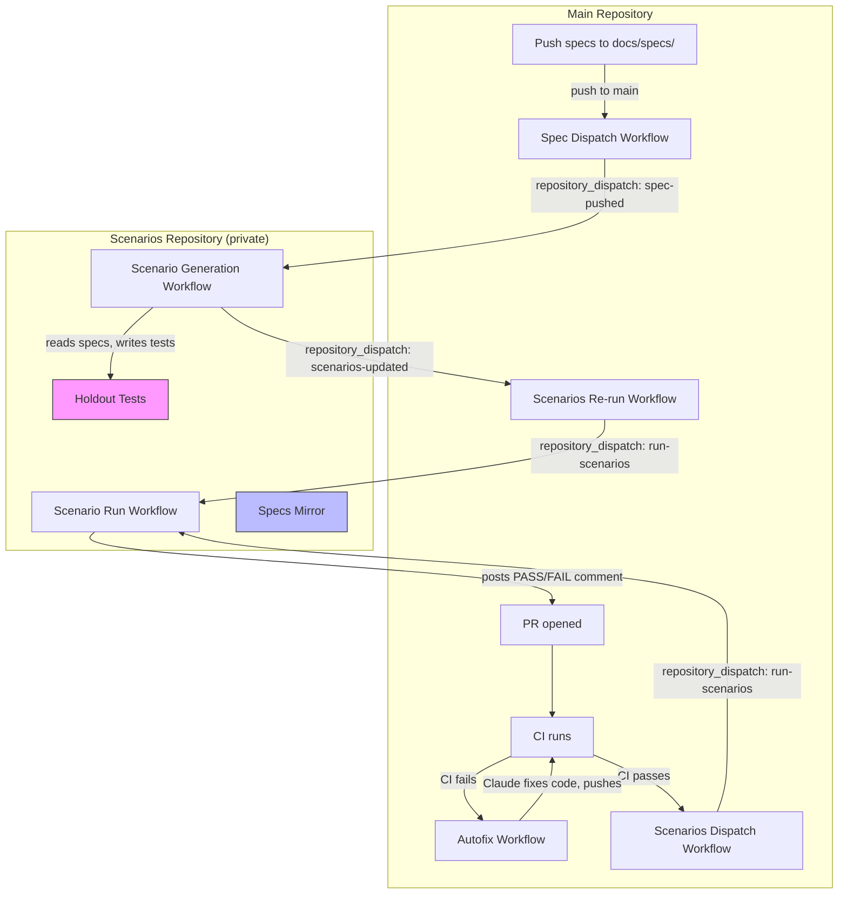
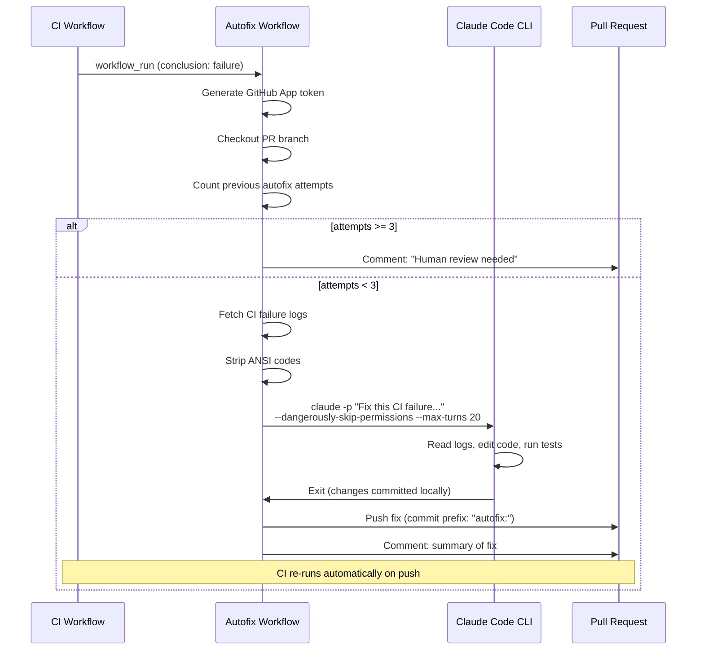
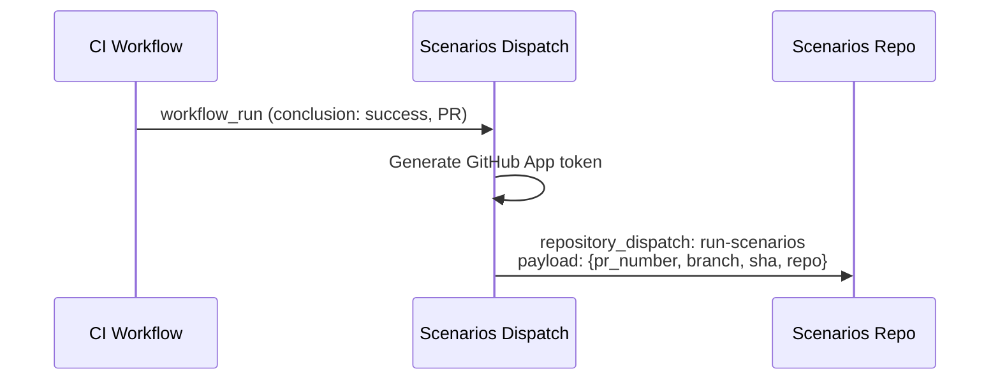
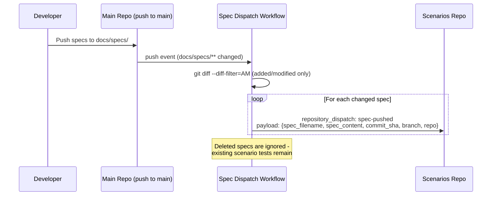
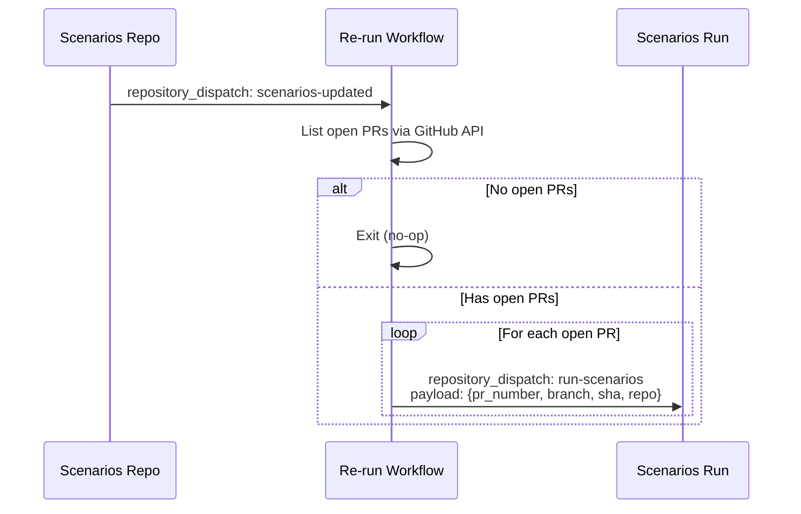
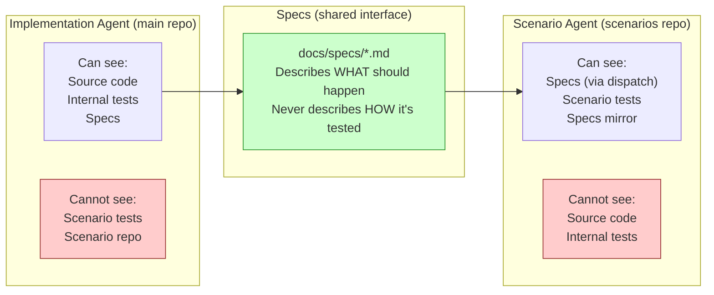
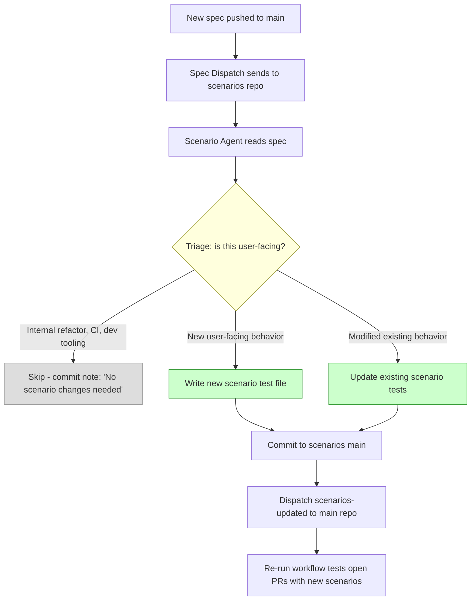
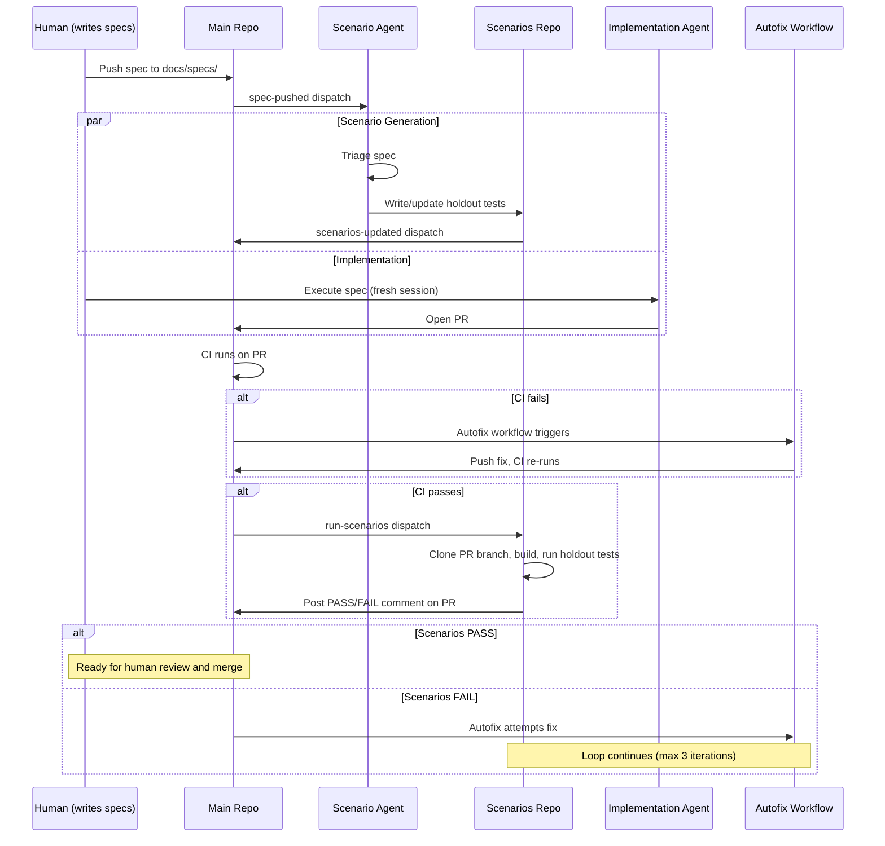

# Level 5: The Autonomous Loop — Full Guide

> [Back to README](../../README.md)

This guide covers the full architecture, setup, and operation of Joycraft's Level 5 autonomous development loop. For a quick overview, see the [Level 5 section in the README](../../README.md#level-5-the-autonomous-loop).

---

> **A note on complexity:** Setting up Level 5 does have some moving parts and, depending on the complexity of your stack (software vs. hardware, monorepo vs. single app, etc.), this will require a good amount of prompting and trial-and-error to get right. I've done my best to make this as painless as possible, but just note - this is not a one-shot-prompt-done-in-5-minutes kind of thing. For small projects and simple stacks it will be easy, but any level of complexity is going to take some iteration, so plan ahead. Full step-by-step guides along with a video coming soon.

Level 5 is where specs go in and validated software comes out. Joycraft implements this as four interlocking GitHub Actions workflows, a separate scenarios repository, and two independent AI agents that can never see each other's work.

Run `/joycraft-implement-level5` in Claude Code for a guided setup, or use the CLI directly:

```bash
npx joycraft init-autofix --scenarios-repo my-project-scenarios --app-id 3180156
```

### Architecture Overview

Level 5 has four moving parts. Each is a GitHub Actions workflow that communicates via `repository_dispatch` events. No custom servers, no webhooks, no external services.



### The Four Workflows

#### 1. Autofix Workflow (`autofix.yml`)

Triggered when CI **fails** on a PR. Claude Code CLI reads the failure logs and attempts a fix.



**Key details:**
- Uses a GitHub App identity for pushes to avoid GitHub's anti-recursion protection
- Concurrency group per PR so only one autofix runs at a time
- Max 3 iterations, then posts "human review needed"
- No `--model` flag. Claude CLI handles model selection.
- Strips ANSI escape codes from logs so Claude gets clean text

#### 2. Scenarios Dispatch Workflow (`scenarios-dispatch.yml`)

Triggered when CI **passes** on a PR. Fires a `repository_dispatch` to the scenarios repo to run holdout tests against the PR branch.



#### 3. Spec Dispatch Workflow (`spec-dispatch.yml`)

Triggered when spec files are pushed to `main`. Sends the spec content to the scenarios repo so the scenario agent can write tests.



#### 4. Scenarios Re-run Workflow (`scenarios-rerun.yml`)

Triggered when the scenarios repo updates its tests. Re-dispatches all open PRs to the scenarios repo so they get tested with the latest holdout tests.



**Why this exists:** There's a race condition. The implementation agent might open a PR before the scenario agent finishes writing new tests. The re-run workflow handles this by re-testing all open PRs when new tests land. Worst case, a PR merges before the re-run, and the new tests protect the very next PR. You're never more than one cycle behind.

### The Holdout Wall

The core safety mechanism. Two agents, two repos, one shared interface (specs):



This is the same principle as a holdout set in machine learning. If the implementation agent could see the scenario tests, it would optimize to pass them specifically instead of building correct software. By keeping the wall intact, scenario tests catch real behavioral regressions, not test-gaming.

### Scenario Evolution

Scenarios aren't static. When you push new specs, the scenario agent automatically triages them and writes new holdout tests.



**The scenario agent's prompt instructs it to:**
- Act as a QA engineer, never a developer
- Write only behavioral tests (invoke the built artifact, assert on output)
- Never import source code or reference internal implementation
- Use a triage decision tree: SKIP / NEW / UPDATE
- Err on the side of writing a test if the spec is ambiguous

**The specs mirror:** The scenarios repo maintains a `specs/` folder that mirrors every spec it receives. This gives the scenario agent historical context ("what features already exist?") without access to the main repo's codebase.

### The Complete Loop

Here's the full lifecycle from spec to shipped, validated code:



### What Gets Installed

| Where | File | Purpose |
|-------|------|---------|
| Main repo | `.github/workflows/autofix.yml` | CI failure → Claude fix → push |
| Main repo | `.github/workflows/scenarios-dispatch.yml` | CI pass → trigger holdout tests |
| Main repo | `.github/workflows/spec-dispatch.yml` | Spec push → trigger scenario generation |
| Main repo | `.github/workflows/scenarios-rerun.yml` | New tests → re-test open PRs |
| Scenarios repo | `workflows/run.yml` | Clone PR, build, run tests, post results |
| Scenarios repo | `workflows/generate.yml` | Receive spec, run scenario agent |
| Scenarios repo | `prompts/scenario-agent.md` | Scenario agent prompt template |
| Scenarios repo | `example-scenario.test.ts` | Example holdout test |
| Scenarios repo | `package.json` | Minimal vitest setup |
| Scenarios repo | `README.md` | Explains holdout pattern to contributors |

### Setup Guide

The fastest way: run `/joycraft-implement-level5` in Claude Code and it walks you through everything interactively. Or follow these steps manually:

#### Step 1: Create a GitHub App

The autofix workflow needs a GitHub App identity to push commits. GitHub blocks workflows from triggering other workflows with the default `GITHUB_TOKEN` -- a separate App identity solves this. Creating one takes about 2 minutes:

1. Go to https://github.com/settings/apps/new
2. Give it a name (e.g., "My Project Autofix")
3. Uncheck "Webhook > Active" (not needed)
4. Under **Repository permissions**, set:
   - **Contents**: Read & Write
   - **Pull requests**: Read & Write
   - **Actions**: Read & Write
5. Click **Create GitHub App**
6. Note the **App ID** from the settings page (you'll need it in Step 2)
7. Scroll to **Private keys** > click **Generate a private key**
8. Save the downloaded `.pem` file -- you'll need it in Step 3
9. Click **Install App** in the left sidebar > install it on the repo(s) you want to use

> **Coming soon:** We're working on a shared Joycraft Autofix app that will reduce this to a single click. For now, creating your own app gives you full control and takes just a couple minutes.

#### Step 2: Run the CLI

```bash
npx joycraft init-autofix --scenarios-repo my-project-scenarios --app-id YOUR_APP_ID
```

Replace `YOUR_APP_ID` with the App ID from Step 1. This installs the four workflow files in your main repo and copies scenario templates to `docs/templates/scenarios/`.

#### Step 3: Add secrets to your main repo

Go to your repo's **Settings > Secrets and variables > Actions** and add:

| Secret | Value |
|--------|-------|
| `JOYCRAFT_APP_PRIVATE_KEY` | The full contents of the `.pem` file from Step 1 |
| `ANTHROPIC_API_KEY` | Your Anthropic API key (used by the autofix workflow to run Claude) |

#### Step 4: Create the scenarios repo

```bash
# Create a private repo for holdout tests
gh repo create my-project-scenarios --private

# Copy the scenario templates into it
cp -r docs/templates/scenarios/* ../my-project-scenarios/
cd ../my-project-scenarios
git add -A && git commit -m "init: scaffold scenarios repo from Joycraft"
git push
```

Then add the **same two secrets** (`JOYCRAFT_APP_PRIVATE_KEY` and `ANTHROPIC_API_KEY`) to the scenarios repo's Settings > Secrets.

#### Step 5: Verify

```bash
# Check workflow files exist in your main repo
ls .github/workflows/autofix.yml .github/workflows/scenarios-dispatch.yml \
   .github/workflows/spec-dispatch.yml .github/workflows/scenarios-rerun.yml

# Check scenario templates in the scenarios repo
ls ../my-project-scenarios/workflows/run.yml ../my-project-scenarios/workflows/generate.yml \
   ../my-project-scenarios/prompts/scenario-agent.md ../my-project-scenarios/example-scenario.test.ts
```

#### Step 6: Test it

1. Push a spec to `docs/specs/` on main -- this triggers scenario generation in the scenarios repo
2. Open a PR with a small change -- when CI passes, scenarios run against the PR
3. Watch for the scenario test results posted as a PR comment

Or deliberately break something in a PR to test the autofix loop.

### Cost

Validated in the Pipit trial (~3 minutes, one iteration, zero human intervention). With Claude Sonnet + `--max-turns 20` + max 3 iterations per PR:
- **Autofix:** ~$0.50 per attempt, worst case ~$1.50 per PR (3 iterations)
- **Scenario generation:** ~$0.20 per spec dispatch
- **Solo dev with ~10 PRs/month:** ~$5-10/month for the full loop

The iteration guard and max-turns cap prevent runaway costs.
